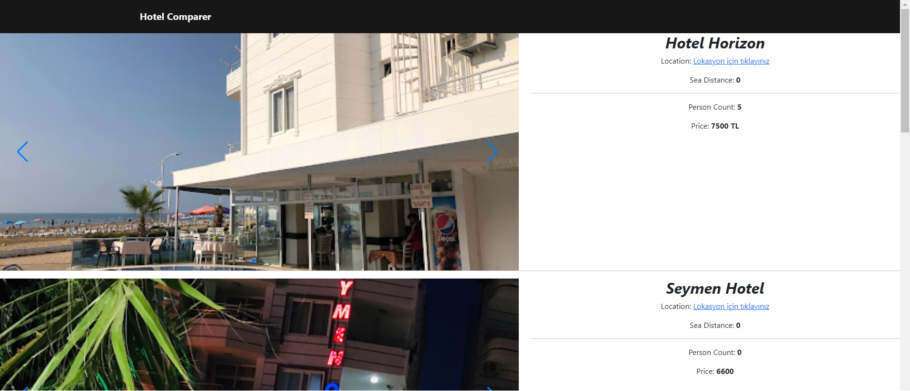
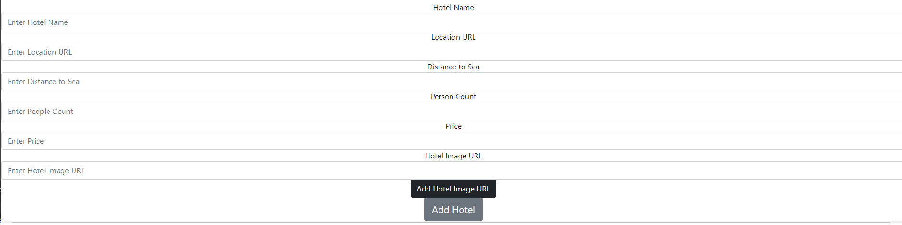

# Simple Hotel Lister

This project is a hotel listing application developed using Node.js, EJS, Express, and NeDB. The purpose of this application is to facilitate comparing different hotels by providing hotel images, prices, and location links from a single site.

## Features

- List hotels
- View hotel images
- Access hotel details (price, location, etc.)
- Directly visit the hotel's Location

## Requirements

- Node.js
- Express.js
- EJS
- NeDB

## Installation

1. Clone this project to your computer:

   ```bash
   git clone https://github.com/username/hotel-listing-project.git
   ```

2. Navigate to the project directory:

   ```bash
   cd hotel-listing-project
   ```

3. Install the necessary dependencies:

   ```bash
   npm install
   ```

4. Start the application:

   ```bash
   node app.js
   ```

5. Go to `http://localhost:3000` in your browser to view the hotel listing application.


## Contributing

Contributions are welcome! You can contribute to the project in various ways. If you find a bug or have a suggestion, you can open an issue on [GitHub](https://github.com/username/simple-hotel-lister/issues).

1. Fork this project
2. Create a new branch: `git checkout -b new-feature`
3. Commit your changes: `git commit -am 'Add new feature'`
4. Push to the branch: `git push origin new-feature`
5. Submit a pull request

## License

This project is licensed under the [MIT License](LICENSE). For more information, please see the [LICENSE](LICENSE) file.
```


```
# Türkçe

Bu basit proje, Node.js, EJS, Express ve NeDB kullanarak geliştirilen bir otel listeleme uygulamasıdır. Bu uygulama, farklı otelleri karşılaştırmayı kolaylaştırmak için otel resimleri, fiyatları ve lokasyon linklerini tek bir sitede sağlar.

## Özellikler

- Otelleri listeleme
- Otelleri fiyata veya lokasyona göre filtreleme
- Otel resimlerini görüntüleme
- Otellerin web sitesine doğrudan erişim

## Gereksinimler

- Node.js
- Express.js
- EJS
- NeDB

## Kurulum

1. Bu projeyi bilgisayarınıza klonlayın:

   ```bash
   git clone https://github.com/kullanici_adi/otel-listeleme-projesi.git
   ```

2. Proje dizinine gidin:

   ```bash
   cd ot

el-listeleme-projesi
   ```

3. Gerekli bağımlılıkları yükleyin:

   ```bash
   npm install
   ```

4. Uygulamayı başlatın:

   ```bash
   node app.js
   ```

5. Tarayıcınızda `http://localhost:3000` adresine gidin ve otelleri listeleyen uygulamayı görüntüleyin.


## Katkıda Bulunma

Katkılarınızı memnuniyetle karşılıyoruz! Projeye çeşitli şekillerde katkıda bulunabilirsiniz. Eğer bir hata bulduysanız veya bir öneriniz varsa, [GitHub](https://github.com/kullanici_adi/otel-listeleme-projesi/issues) üzerinde bir sorun açabilirsiniz.

1. Bu projeyi fork edin
2. Yeni bir dal (branch) oluşturun: `git checkout -b yeni-ozellik`
3. Yaptığınız değişiklikleri kaydedin: `git commit -am 'Yeni özellik ekle'`
4. Dalınıza gönderin: `git push origin yeni-ozellik`
5. Birleştirme isteği (pull request) gönderin

## Lisans

Bu proje [MIT Lisansı](LICENSE) ile lisanslanmıştır. Daha fazla bilgi için [LİSANS](LICENSE) dosyasına bakabilirsiniz.


## ScreenShots




