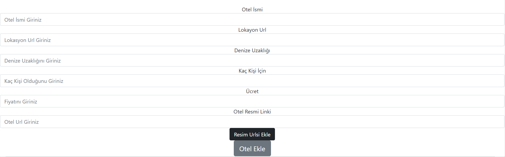

# simple-hotel-lister
With this project you can list hotels and list all hotel in one page
I developed this project for my own need in a simple way using node ejs and js.

- Easy to use
- Fast
- Offline Working

## Installation

##### Make Sure Nodejs Is Installed On Your Device Before Running This Project. You Must Install nodejs !!
- For Installing Dependencies In The Project Folder Run 
```sh
npm install
```
- For run project 
```sh
npm start
```
or
```sh
node index.js
```
## Using
1. Click Add Hotel Button 
2. You must add image links before the other things
3. Fill the other forms
4. Click Add Hotel 
## Screenshots

#### Main Page

#### Add Hotel Page

